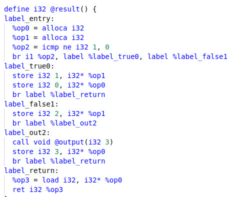

# Lab3 实验报告

小组成员 姓名 学号

队长姓名:***

队长学号:********

队员1姓名:***

队员1学号:********

队员2姓名:***

队员2学号:********

## 实验难点

### ASTProgram

该模块对应的语法如下

 $`\text{program} \rightarrow \text{declaration-list}`$

 program为根节点，其孩子为declaration-list,则需要将node指针的declaration变量accept向下递归遍历。

 ### ASTNum

 该模块需要区别node指针内容为int型还是float型，分类讨论。

 ### ASTVarDeclaration

 该模块对应的语法如下

 $`\text{var-declaration}\ \rightarrow \text{type-specifier}\ \textbf{ID}\ \textbf{;}\ |\ \text{type-specifier}\ \textbf{ID}\ \textbf{[}\ \textbf{INTEGER}\ \textbf{]}\ \textbf{;}`$

 该语法为变量声明的部分，在代码中，需要考虑变量声明是否存在[INTEGER]部分，且需要对变量是否为全局变量分类讨论，若为全局变量则在scope中分配空间，否则直接分配即可。

 ### ASTFunDeclaration

 该模块对应的语法如下

 $`\text{fun-declaration} \rightarrow \text{type-specifier}\ \textbf{ID}\ \textbf{(}\ \text{params}\ \textbf{)}\ \text{compound-stmt}`$

 该语法为函数声明的部分，首先需要对传递的参数params进行读入，参数可能存在一个或多个，需要进行循环读入，同时判断传入的参数是否为数组类型。读入参数后，需要创建函数体。先创建函数类型，后创建函数。将参数accept接受遍历后，需要根据函数的类型将函数的val传入到scope中。同时，函数体的内容与函数的返回值需要向下accept遍历。

 循环读入

    std::transform
    (
        node.params.begin(), node.params.end(), std::back_inserter(params), [this](const auto &param)
        {
            auto contained = type(param->type);
            return param->isarray ? module->get_pointer_type(contained) : contained;
        }
    );

传入val值

    if (node.type != CminusType::TYPE_VOID)
        {
            val = builder->create_alloca(type(return_type));
            scope.push(return_val, val);
        }

 ### ASTParam

 该模块对应的语法如下

 $`\text{param} \rightarrow \text{type-specifier}\ \textbf{ID}\ |\ \text{type-specifier}\ \textbf{ID}\ \textbf{[]}`$

 需要对类型进行判断，是否为数组。根据类型申请所需要的空间，将其上传到scope域中。

 ### ASTCompoundStmt

 该模块对应的语法如下

 $`\text{compound-stmt} \rightarrow \textbf{\{}\ \text{local-declarations}\ \text{statement-list} \textbf{\}}`$

由于处于函数内部，需要进入scope，再对本地声明与statement进行accept操作，最后退出scope域。

### ASTExpressionStmt

该模块对应的语法如下

$`\text{expression-stmt} \rightarrow \text{expression}\ \textbf{;}\ |\ \textbf{;}`$

若expression存在，对其进行accept遍历即可。

### ASTSelectionStmt

该模块对应的语法如下

$`\begin{aligned}\text{selection-stmt} \rightarrow\ &\textbf{if}\ \textbf{(}\ \text{expression}\ \textbf{)}\ \text{statement}\\ &|\ \textbf{if}\ \textbf{(}\ \text{expression}\ \textbf{)}\ \text{statement}\ \textbf{else}\ \text{statement}\end{aligned}`$

先对expression进行accept遍历操作，判断expression的类型，将它的值即if的结果存到value中，同时创建truebb与out部分，若存在else部分，则需要创建falsebb，根据val的不同值，需要进入不同的bb。

计算expression的值

    if (val->get_type()->get_size() > 1)
        {
            if (val->get_type()->is_integer_type())
                val = comp_int_map[RelOp::OP_NEQ](val, CONST_INT(0));
            else
                val = comp_float_map[RelOp::OP_NEQ](val, CONST_FP(0));
        }

### ASTIterationStmt

该模块对应的语法如下

$`\text{iteration-stmt} \rightarrow \textbf{while}\ \textbf{(}\ \text{expression}\ \textbf{)}\ \text{statement}`$

与ASTSelectionStmt模块相同，accept遍历expression后，判断其类型，创建判断，循环，跳出三个bb，判断部分需要每次判断expression的值，决定继续循环或者跳出结束。

判断部分的循环

    builder->set_insert_point(predicate);
    node.expression->accept(*this);
    if (val->get_type()->get_size() > 1)
        {
            if (val->get_type()->is_integer_type())
                val = comp_int_map[RelOp::OP_NEQ](val, CONST_INT(0));
            else
                val = comp_float_map[RelOp::OP_NEQ](val, CONST_FP(0));
        }
    builder->create_cond_br(val, body, out);

### ASTReturnStmt

该模块对应的语法如下

$`\text{return-stmt} \rightarrow \textbf{return}\ \textbf{;}\ |\ \textbf{return}\ \text{expression}\ \textbf{;}`$

首先需要判断是return void还是return expression，若存在expression则需要accept遍历，然后根据全局变量，判断此次return语句是否为分支语句中的return。若为分支语句，则需要将返回的val存到scope域中，若不是，则将scope域中的值取出，然后根据全局变量判断之前是否存在分支语句的return，若存在，则需要遍历之前的bb，判断需要返回哪一个bb中的val，，若不存在，返回ret即可。当返回void时，操作大致与上相同。

对分支语句的操作

    if (in_branch)
        {
            Value *ptr = scope.find(return_val);
            builder->create_store(convert(val, type(t)), ptr);
            return_in_branch = true;
            pre_returns = true;
        }

遍历之前的bb

    for (auto &bb : builder->get_insert_block()->get_parent()->get_basic_blocks())
        {
            if (bb == returnBB)
                continue;
            if (!bb->get_terminator())
                {
                    builder->set_insert_point(bb);
                    builder->create_br(returnBB);
                }
        }

### ASTVar

该模块对应的语法如下

$`\text{var} \rightarrow \textbf{ID}\ |\ \textbf{ID}\ \textbf{[}\ \text{expression} \textbf{]}`$

首先在scope域中取出id，需要判断是否存在expression，由于数组类型，expression需要为int类型，则需要进行一次类型转换。同时，数组下标的非负性需要我们将expression与0进行一次比较，同时id也可能存在为数组的可能性，它本质上是一个指针，指向了一块内存空间，这个内存空间存放了数组首地址，当其为数组时，我们用create_gep取值并返回即可。

与0进行比较

    Value *nonnegative = comp_int_map[RelOp::OP_GE](offset, CONST_INT(0));

通过gep取值

    if (ptr->get_type()->get_pointer_element_type()->is_array_type())
        {
            ptr = builder->create_gep(ptr, {CONST_INT(0), offset});
        }
    else if (ptr->get_type()->get_pointer_element_type()->is_pointer_type())
        {
            ptr = builder->create_load(ptr);
            ptr = builder->create_gep(ptr, {offset});
        }

### ASTAssignExpression

该模块对应的语法如下

$`\text{expression} \rightarrow \text{var}\ \textbf{=}\ \text{expression}\ |\ \text{simple-expression}`$

通过accept函数获取expression与var的值即可，注意保持两者的类型一致。

### ASTSimpleExpression

该模块对应的语法如下

$`\text{simple-expression} \rightarrow \text{additive-expression}\ \text{relop}\ \text{additive-expression}\ |\ \text{additive-expression}`$

accept第一个additive-expression后，需要判断是否存在另外一个additive-expression，若存在，则需要将两者的数据类型进行统一，若其中存在至少一个浮点数，则需将两者全部转化为浮点数类型进行运算，否则进行整数运算即可。

判断浮点数的个数

    if (both_int(lhs, rhs))
        {
            lhs = convert(lhs, module->get_int32_type()); 
            rhs = convert(rhs, module->get_int32_type());
            val = comp_int_map[node.op](lhs, rhs);
        }
    else 
        {
            lhs = convert(lhs, module->get_float_type());
            rhs = convert(rhs, module->get_float_type());
            val = comp_float_map[node.op](lhs, rhs);
        }

### ASTAdditiveExpression

该模块对应的语法如下

$`\text{additive-expression} \rightarrow \text{additive-expression}\ \text{addop}\ \text{term}\ |\ \text{term}`$

需要判断是否存在additive-expression，若不存在，直接调用accept函数，就可以完成访问者遍历并跳转到子节点（term），否则，需要将term与additive-expression的数据类型进行统一，若其中存在至少一个浮点数，则需将两者全部转化为浮点数类型进行运算，否则进行整数运算即可。

### ASTTerm

该模块对应的语法如下

$`\text{term} \rightarrow \text{term}\ \text{mulop}\ \text{factor}\ |\ \text{factor}`$

需要判断是否存在term，若不存在，直接调用accept函数，就可以完成访问者遍历并跳转到子节点（factor），否则，需要将term与factor的数据类型进行统一，若其中存在至少一个浮点数，则需将两者全部转化为浮点数类型进行运算，否则进行整数运算即可。

### ASTCall

该模块对应的语法如下

$`\text{call} \rightarrow \textbf{ID}\ \textbf{(}\ \text{args} \textbf{)}`$

进入对应的scope域，取出函数声明的id。且需要将args循环写入vector容器中。

### 实验的实现结果

两个测试样例

#### 样例一：result

实现如下

#### 样例二：gcd

实现如下

## 实验设计

### 全局变量的设计

所有的全局变量初始值均赋以0。

#### address_only

该全局变量用以判断是否需要进行地址操作。若目标操作为值，则需要进行load或store操作，操作对应的值。

    val = this->address_only ? ptr : builder->create_load(ptr);

#### return_in_branch

该全局变量用于判断分支语句中是否有返回，如果有则不跳转到 out 中，需要跳转到returnbb中。

    if (!return_in_branch)  
        builder->create_br(out);

#### in_branch

该全局变量用于判断当前 builder 是否处于分支语句中，主要用在 return statement 判断该 store 还是 load

    if (in_branch)

        {
            Value *ptr = scope.find(return_val);

            builder->create_store(convert(val, type(t)), ptr);

            return_in_branch = true;

            pre_returns = true;

        }

#### pre_returns

该全局变量用于判断在之前的语句中是否有 return, 创建一个基本块用来返回

    if (pre_returns)
            {
                auto returnBB = BasicBlock::create(module.get(), "return", builder->get_insert_block()->get_parent());
                ......
                builder->set_insert_point(returnBB);
            }

#### enter_in_fun_decl

该全局变量用于将函数参数和返回值写入到scope域中。

    if (!enter_in_fun_decl)
            scope.enter();
    enter_in_fun_decl = false;

#### std::string return_val{""}

该全局变量用于中间存储函数内的返回值，设置为空避免冲突的发生。

    val = builder->create_load(scope.find(return_val));
    builder->create_ret(val);   

### 实验总结

该实验对于情况的分类较多，对于何时进入何时退出scope域有着比较明确的要求，从根节点自上而下遍历的过程中，并非简单的翻译语法的过程，如何选择何时的展开，比较重要。

在后期的调试debug的过程中，如何设置合适的全局变量也是一门比较大的学问，合适的全局变量，让代码显得流畅整齐，而非冗余臃肿。

### 实验反馈 （可选 不会评分）

对本次实验的建议

### 组间交流 （可选）

无
